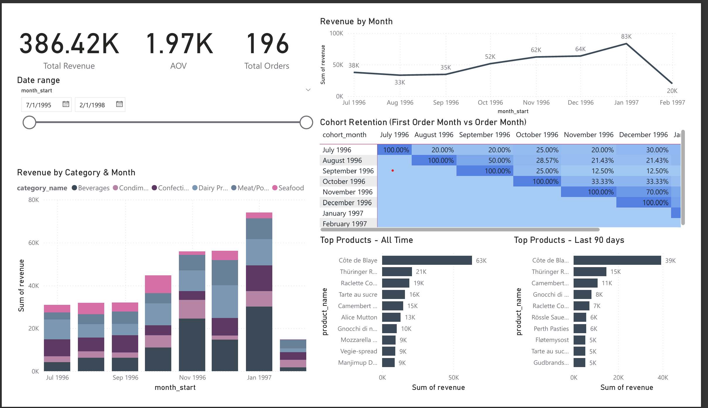
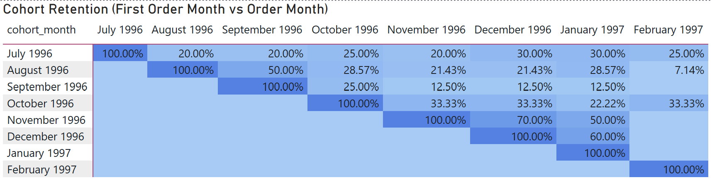

# Northwind Retail SQL Warehouse (Postgres + Power BI)

**One-page retail analytics dashboard** built from the classic Northwind dataset.  
Designed a **star-schema warehouse**, automated SQL transforms, added **data quality checks**, and visualized **Revenue, Category mix, Top Products, and Cohort Retention** in Power BI.

## 🔧 Tech Stack
- **Database:** PostgreSQL
- **Transforms:** Pure SQL (staging → dims → fact → analytic views)
- **Data Quality:** SQL checks + log tables (`meta.run_log`, `meta.quality_log`)
- **BI:** Power BI Desktop (Import mode)
- **Source Data:** Northwind (orders, order details, products, customers …)

## 🧱 Data Model (Star Schema)

                    dim_category      dim_supplier
                           \             /
                            \           /
                           dim_product
                                 |
                                 |
      dim_date   dim_customer   dim_employee   dim_shipper
        \           |               |             /
         \          |               |            /
                    fact_order_items

**Fact:** `mart.fact_order_items(orderdetail_id, order_id, date_key, customer_key, product_key, employee_key, shipper_key, quantity, unit_price, discount=0, line_revenue)`  
**Dims:** `dim_date`, `dim_customer`, `dim_product` (snowflaked to `dim_category`, `dim_supplier`), `dim_employee`, `dim_shipper`

**Note:** Source `orderdetails` lacked UnitPrice/Discount, so **unit_price** comes from product price and **discount=0** (documented assumption).

## 📊 Dashboard (Power BI)
- KPIs: **Total Revenue**, **Total Orders**, **AOV**
- Trend: **Revenue by Month**
- Mix: **Revenue by Category & Month**
- Leaders: **Top Products (All-time & Last 90 Days)**
- Retention: **Cohort heatmap** (First-order month × Activity month)

**Screenshots**
- 
- 

## 📝 Insights
- Revenue trend from 1995–1998 shows clear seasonality  
- Category mix shifts across months (top drivers stand out)  
- Top products differ in all-time vs last 90 days view  
- Cohort analysis shows retention drops after month 1  
